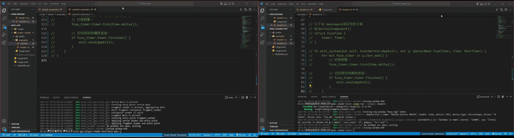
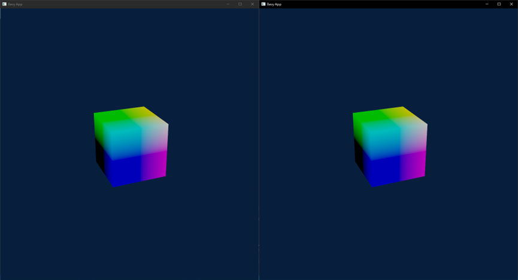

# Bevy Shader Path Comparison
This repository documents a Bevy shader-path comparison between a WGSL material path and a Rust-GPU plugin-based path, presenting two paired cube material cases with each implemented through both paths. It is a later reorganization of work preserved in the original WGSL and Rust-GPU repositories, together with historical project documentation. The work originated in a four-person university capstone project conducted from September 2022 to June 2023.

## Why This Project Compared These Paths
Rendering was chosen as the technical focus because shader materials connect shader code, material setup in the engine, shader tooling, and the rendered result. This made shader materials a suitable place to study how rendering logic moves through an engine workflow. In this repository, the workflow is discussed through Bevy’s material system.

Within Bevy’s material system, the WGSL material path served as the baseline workflow. Rust-GPU became the second path because it represented the SPIR-V-oriented shader workflow in this comparison: shader logic could be written in Rust, built through Rust-GPU tooling, and connected back to Bevy through the [`bevy-rust-gpu`](https://github.com/Bevy-Rust-GPU/bevy-rust-gpu) plugin. The comparison examined how shader authoring and Bevy integration differed between the two paths.

## What Was Built
The completed work centers on two paired material demos:

- Case 1: dynamic Oklab color-mixing cube material
- Case 2: static world-position gradient cube material

Each case includes both sides of the comparison: a WGSL material version and a Rust-GPU plugin-based version. Each case also includes the app setup, shader implementation, and a visual comparison result showing how similar material behavior was expressed through the two paths.

## Repository Layout
| Path | Purpose |
|---|---|
| [`wgsl-material-path/`](wgsl-material-path/) | WGSL-based Bevy material examples and local WGSL shader assets. |
| [`rust-gpu-plugin-path/`](rust-gpu-plugin-path/) | Rust-GPU plugin-based path, including the Rust shader workspace and Bevy examples that load the generated shader artifact. |
| [`assets/results/`](assets/results/) | Rendered comparison results from the WGSL and Rust-GPU plugin-based paths. |
| [`reproduction-timing-results/`](reproduction-timing-results/) | Raw [`hyperfine`](https://github.com/sharkdp/hyperfine) outputs for the command-level reproduction timings. |

## Pipeline Comparison
The table below compares how the WGSL material path and the Rust-GPU plugin-based path are organized, from shader authoring and material setup to Bevy rendering and the final cube output.

| Aspect | WGSL material path | Rust-GPU plugin-based path |
|---|---|---|
| Shader authoring | WGSL shader logic | Rust shader logic |
| App / material setup | Bevy material setup with a WGSL shader reference | `RustGpuMaterial` setup through [`bevy-rust-gpu`](https://github.com/Bevy-Rust-GPU/bevy-rust-gpu) |
| Extra build step | None | Rust-GPU build workflow |
| Generated shader output | None | SPIR-V output |
| Bevy integration | Through Bevy’s material workflow | Through the [`bevy-rust-gpu`](https://github.com/Bevy-Rust-GPU/bevy-rust-gpu) plugin |
| Final rendering path | Bevy / wgpu-backed rendering | Bevy / wgpu-backed rendering |
| Output | Rendered cube output | Rendered cube output |
| Main difference | Direct WGSL material path | Extra Rust-GPU build step and plugin bridge |

> Both paths are compared only up to the shared Bevy / wgpu-backed rendering path; renderer-internal and graphics-backend details are outside this comparison.

## Case Studies
This section presents two paired material cases that focus on shader-driven material behavior across the WGSL material path and the Rust-GPU plugin-based path. In both visual results below, the Rust-GPU plugin-based version is shown on the left and the WGSL version on the right.

### Case 1: Dynamic Oklab Color-Mixing Material
  
This case adds shader-driven animated material behavior to the comparison. The shader varies the color mix over time and uses UV distance from the surface center to shape the surface variation. The mixed Oklab color is then converted back to linear sRGB for output. The GIF presents the paired rendered outputs for the resulting animated material behavior.

Sources: [WGSL app setup](wgsl-material-path/apps/case1-wgsl-app.rs), [WGSL shader](wgsl-material-path/assets/shaders/case1/case1-dynamic-wgsl.wgsl), [Rust-GPU app setup](rust-gpu-plugin-path/bevy-app/apps/case1-rust-app.rs), [Rust-GPU shader](rust-gpu-plugin-path/rust-gpu/crates/shader/src/case1-dynamic-rust.rs)

### Case 2: Static World-Position Gradient Material
  
This case provides a direct shader-data mapping in the comparison: world-position data is used as fragment color output. The image presents the paired rendered outputs for this position-based material behavior.

Sources: [WGSL app setup](wgsl-material-path/apps/case2-wgsl-app.rs), [WGSL shader](wgsl-material-path/assets/shaders/case2/case2-gradient-wgsl.wgsl), [Rust-GPU app setup](rust-gpu-plugin-path/bevy-app/apps/case2-rust-app.rs), [Rust-GPU shader](rust-gpu-plugin-path/rust-gpu/crates/shader/src/case2-gradient-rust.rs)

## Reproduction Timing Notes
These are command-level wall-clock timings for reproducing the examples, not measurements of shader runtime, frame rendering, or GPU performance. All Bevy apps were run in release mode and configured to exit after one second. The timings include this runtime window along with startup, asset loading, render setup, and shutdown overhead.

| Path | Case 1 | Case 2 |
|---|---:|---:|
| WGSL material path | 1.608 ± 0.018 s | 1.605 ± 0.014 s |
| Rust-GPU plugin-based path | 1.704 ± 0.047 s | 1.696 ± 0.028 s |

The Rust-GPU plugin-based path also requires a separate shader artifact build command, measured at 0.786 ± 0.024 s in this run. Raw [`hyperfine`](https://github.com/sharkdp/hyperfine) results are available in [`reproduction-timing-results/`](./reproduction-timing-results/).

## Reproduction Notes
Build and run commands are documented in the path-specific READMEs:

- WGSL material path: [README](wgsl-material-path/README.md)
- Rust-GPU plugin-based path: [README](rust-gpu-plugin-path/README.md)

The Rust-GPU plugin-based path uses [`rust-gpu-builder`](rust-gpu-plugin-path/rust-gpu/crates/rust-gpu-builder) as a submodule. Clone with submodules, or initialize submodules after cloning:
```bash
git submodule update --init --recursive
```

## Project Scope
- This repository uses existing Rust-GPU and [bevy-rust-gpu](https://github.com/Bevy-Rust-GPU/bevy-rust-gpu) tooling for the Rust-GPU plugin-based path; those external tools are not implemented by this project.
- The visual comparison results show observable material behavior, not pixel-perfect or formal shader equivalence.
- The two material cases are comparison examples, not complete coverage of Bevy shader authoring patterns or Rust-GPU capabilities.

## My Contribution
Within the original four-person capstone project, I was responsible for the programming and technical implementation of the shader comparison. My work focused on investigating and implementing the Rust-GPU shader workflow, generating SPIR-V shader artifacts, and integrating them into Bevy using the existing `bevy-rust-gpu` plugin.

Using Bevy's official WGSL shader examples as the baseline, I adapted and validated the corresponding Rust-GPU implementations for the two comparison cases presented in this repository.

## Baseline and Attribution
The shader implementations in this project were developed with reference to Bevy's official WGSL shader examples.

| Case | Official Bevy Reference | Adaptation |
|---|---|---|
| Case 1: Dynamic Oklab Color Mixing | [animate_shader.wgsl](https://github.com/bevyengine/bevy/blob/release-0.10.0/assets/shaders/animate_shader.wgsl) | Adapted the official WGSL shader and ported its color-mixing logic to Rust-GPU. |
| Case 2: World-Position Gradient | [instancing.wgsl](https://github.com/bevyengine/bevy/blob/release-0.10.0/assets/shaders/instancing.wgsl) | Used the official shader as a reference, then changed the shader behavior to visualize world-space position as a color gradient. The modified WGSL behavior was also implemented in Rust-GPU. |

The Bevy application setups were developed separately by following official Bevy tutorials and documentation, with iterative implementation, testing, and adjustments for these comparison cases.

## License
The project is licensed under the [MIT License](LICENSE).
